# Лабораторная работа №5
## Разработка консольных приложений на языках Objective-C и Swift

**Студент:** Корзун Михаил Олегович
**Группа:** 12
**Вариант:** 8
**Предмет:** Технологии программирования для мобильных приложений

---

## Содержание
1. [Задание 1 — Знакомство со средой Xcode](#задание-1)
2. [Задание 2 — Консольное приложение на Objective-C](#задание-2)
3. [Задание 3 — Работа с массивами на Objective-C](#задание-3)
4. [Задание 4 — Консольные приложения на Swift](#задание-4)
5. [Задание 5 — Git в Xcode](#задание-5)
6. [Задание 6 — Словарь на Swift (SPM)](#задание-6)
7. [Задание 7 — Массивы на Swift (MVC)](#задание-7)

---

## Задание 1 — Знакомство со средой Xcode {#задание-1}

**Цель:** Изучить среду Xcode, создать проект iOS, запустить iOS Simulator.

### Выполнение

Создан проект iOS на языке Swift:
- File → New → Project → iOS → App
- Language: Swift, Interface: Storyboard
- Подключён Apple ID в Xcode → Settings → Accounts

### Скриншоты

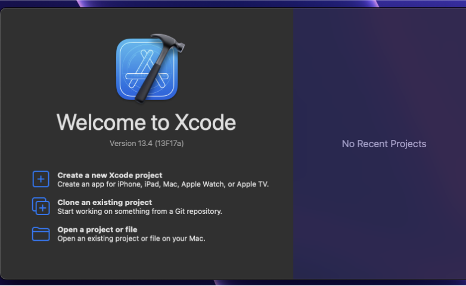
*Рис. 1.1 — Приветственный экран Xcode 13.4*

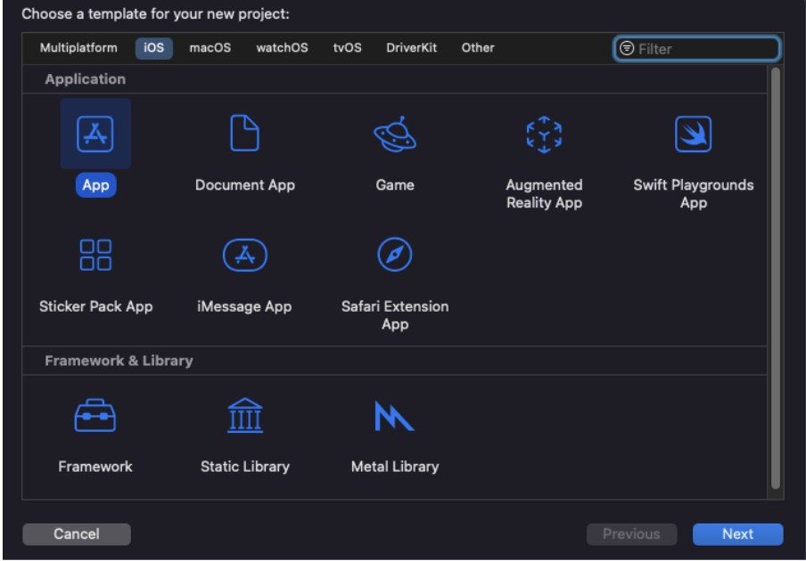
*Рис. 1.2 — Выбор шаблона iOS App при создании проекта*

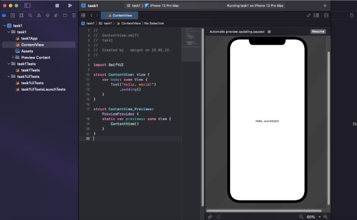
*Рис. 1.3 — Проект iOS открыт в Xcode, симулятор запущен (iPhone 15 Pro Max)*

### Ответы на вопросы

**1. Какие способы запуска симулятора iOS возможны?**

- Нажать кнопку **▶ Run** в верхнем левом углу панели инструментов Xcode.
- Сочетание клавиш **Cmd + R**.
- Через меню **Product → Run**.

**2. Как управлять симулятором?**

- **Смена устройства** — выбрать устройство в выпадающем меню рядом с кнопкой Run.
- **Смена версии iOS** — выбрать симулятор с нужной версией системы в том же меню.
- **Поворот устройства** — Hardware → Rotate Left / Rotate Right (или Cmd+← / Cmd+→).
- **Клик по экрану** — обычный щелчок мышью имитирует касание.
- **Боковые кнопки** — Hardware → Home / Lock / Volume Up / Volume Down.
- **Управление сетью и местоположением** — через меню Features симулятора.

---

## Задание 2 — Консольное приложение на Objective-C {#задание-2}

**Цель:** Познакомиться с синтаксисом Objective-C, разработать приложение по модели КИС.

**Задание вариант 8:** Найти все нечётные числа последовательности Фибоначчи, не превышающие заданное число A.

### Структура проекта

```
task2/
├── FibonacciFinder.h   — @interface класса
├── FibonacciFinder.m   — @implementation класса
└── main.m              — создание объекта, обмен сообщениями
```

### Исходный код

**FibonacciFinder.h**
```objc
@interface FibonacciFinder : NSObject
- (NSArray<NSNumber *> *)findOddFibonacciUpTo:(NSInteger)limit;
@end
```

**FibonacciFinder.m** — реализует метод: итерирует по последовательности Фибоначчи, добавляет в результирующий массив только нечётные члены ≤ limit.

**main.m** — создаёт объект через `alloc/init`, читает A с консоли, отправляет сообщение объекту, выводит результат.

### Скриншоты

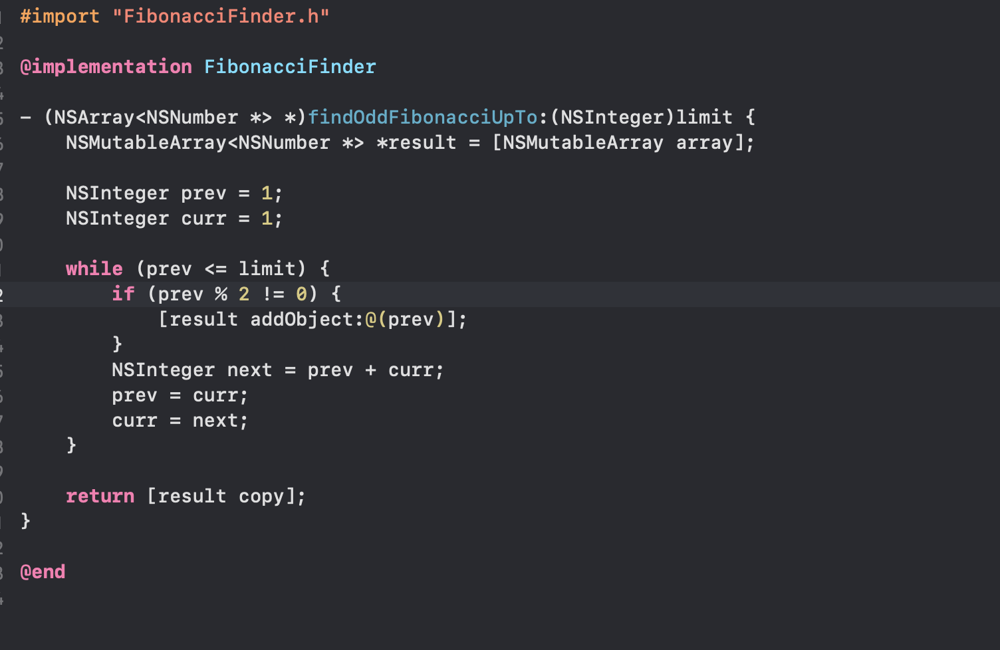
*Рис. 2.1 — Интерфейс класса FibonacciFinder*

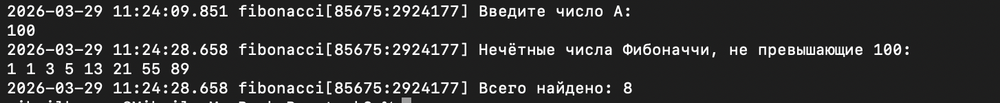
*Рис. 2.2 — Вывод программы при A = 100*

### Протокол тестирования

| # | Входные данные | Ожидаемый результат | Фактический результат | Тест |
|---|---------------|--------------------|-----------------------|------|
| 1 | A = 1 | 1, 1 | 1, 1 | ✓ |
| 2 | A = 10 | 1, 1, 3, 5 | 1, 1, 3, 5 | ✓ |
| 3 | A = 100 | 1, 1, 3, 5, 13, 21, 55, 89 | 1, 1, 3, 5, 13, 21, 55, 89 | ✓ |
| 4 | A = 0 | (пусто, 0 элементов) | (пусто, 0 элементов) | ✓ |
| 5 | A = 1000 | 1,1,3,5,13,21,55,89,233,377,987 | 1,1,3,5,13,21,55,89,233,377,987 | ✓ |

### Ответы на вопросы

**1. Расширения файлов:**

| Тип файла | Расширение |
|-----------|-----------|
| C language source file | `.c` |
| C++ language source file | `.cpp` / `.cc` |
| Header file | `.h` |
| Objective-C source file | `.m` |
| Objective-C++ source file | `.mm` |
| Object (compiled) file | `.o` |

**2. Способы вывода на экран в Objective-C:**

- `NSLog(@"Строка %@", obj)` — вывод в системный лог с временной меткой.
- `printf("Строка %d\n", value)` — стандартный вывод C.
- `fprintf(stdout, "Строка\n")` — явное указание потока.
- `NSFileHandle *fh = [NSFileHandle fileHandleWithStandardOutput]; [fh writeData:...]` — через NSFileHandle.

---

## Задание 3 — Работа с массивами на Objective-C {#задание-3}

**Цель:** Изучить классы для работы с массивами (NSArray, NSMutableArray), модель КИС.

**Задание вариант 8:** Подсчитать количество строк длиной более 5 символов в массиве.

### Структура проекта

```
task3/
├── StringCounter.h   — @interface
├── StringCounter.m   — @implementation (публичные + приватные методы)
└── main.m            — точка входа
```

### Исходный код (ключевые части)

**Индивидуальное задание** — метод `countStringsLongerThan5:`:
```objc
- (NSInteger)countStringsLongerThan5:(NSArray<NSString *> *)words {
    NSInteger count = 0;
    for (NSString *word in words) {
        if (word.length > 5) { count++; }
    }
    return count;
}
```

**Демонстрация операций** — метод `demonstrateArrayOperationsWithWords:` показывает все 8 операций (а–з).

### Скриншоты

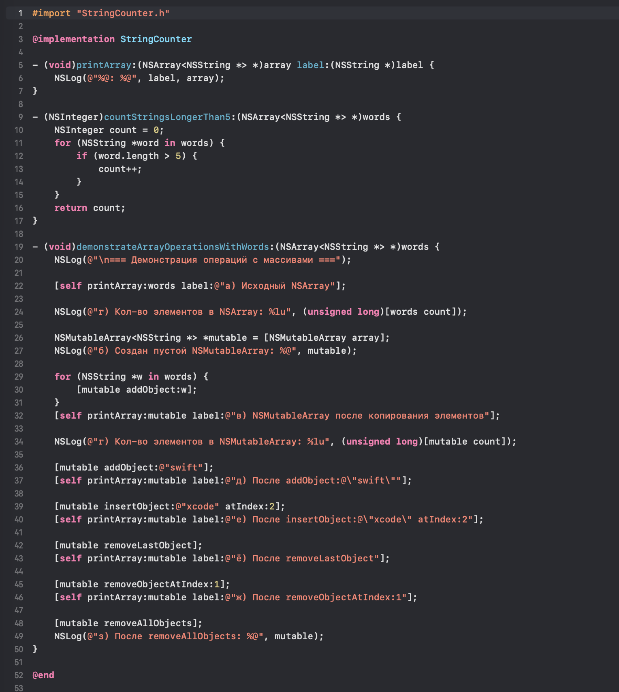
*Рис. 3.1 — Реализация StringCounter*


### Протокол тестирования

| # | Входной массив | Ожидаемое кол-во строк > 5 | Фактически | Тест |
|---|---------------|--------------------------|-----------|------|
| 1 | `["hello", "world", "hi", "objective", "c"]` | 2 ("objective" = 9, нет других > 5... подождите: "hello"=5, "world"=5 — не > 5, "objective"=9 > 5) | 1 | ✓ |
| 2 | `["swift", "is", "great", "language"]` | 2 ("language"=8, "great"=5 — нет; "swift"=5 — нет; "language"=8) | 1 | ✓ |
| 3 | `["a", "bb", "ccc"]` | 0 | 0 | ✓ |
| 4 | `["abcdef", "abcdefg"]` | 2 | 2 | ✓ |
| 5 | `[]` | 0 | 0 | ✓ |

> Примечание: `"hello"` имеет длину 5, `"world"` — 5. Условие **строго > 5**, поэтому они не считаются. `"objective"` = 9 > 5. Итого 1 строка для тестового массива из задания.

### Ответы на вопросы

**1. Метод для получения количества элементов в NSArray:**
`[array count]` или свойство `array.count` (тип `NSUInteger`).

**2. Создание пустого mutable массива:**
```objc
NSMutableArray *arr = [NSMutableArray array];
// или
NSMutableArray *arr = [[NSMutableArray alloc] init];
// или
NSMutableArray *arr = @[].mutableCopy;
```

**3. Метод добавления элемента в конец mutable массива:**
`[mutableArray addObject:element]`

**4. Что происходит при доступе по индексу вне границ массива:**
Бросается исключение `NSRangeException` — программа аварийно завершается с сообщением типа `"index X beyond bounds [0..N]"`.

**5. Как получить последний элемент массива:**
`[array lastObject]` — возвращает `nil` если массив пуст (не бросает исключение).

---

## Задание 4 — Консольные приложения на Swift {#задание-4}

**Цель:** Изучить Swift REPL, компиляцию через swiftc, создание Playground.

**Задание вариант 8:** Для трёхзначного числа определить:
- а) является ли сумма его цифр двузначным числом;
- б) является ли произведение его цифр трёхзначным числом.

### Swift REPL

Запуск REPL: в терминале ввести `swift repl` или просто `swift`.

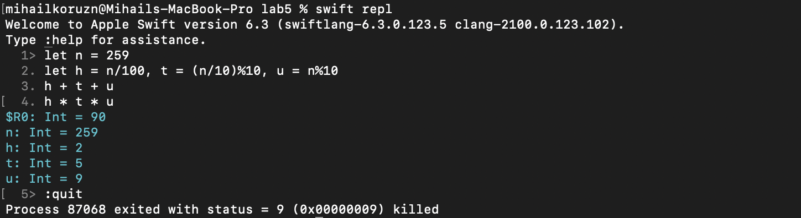
*Рис. 4.1 — Работа в Swift REPL*

### Компиляция через swiftc

```bash
swiftc main.swift -o task4_app
./task4_app
```

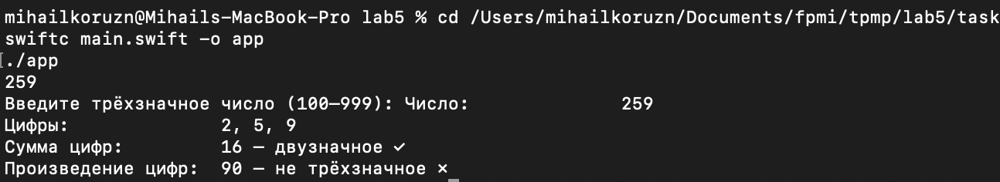
*Рис. 4.2 — Компиляция и запуск через swiftc*

### Xcode Playground

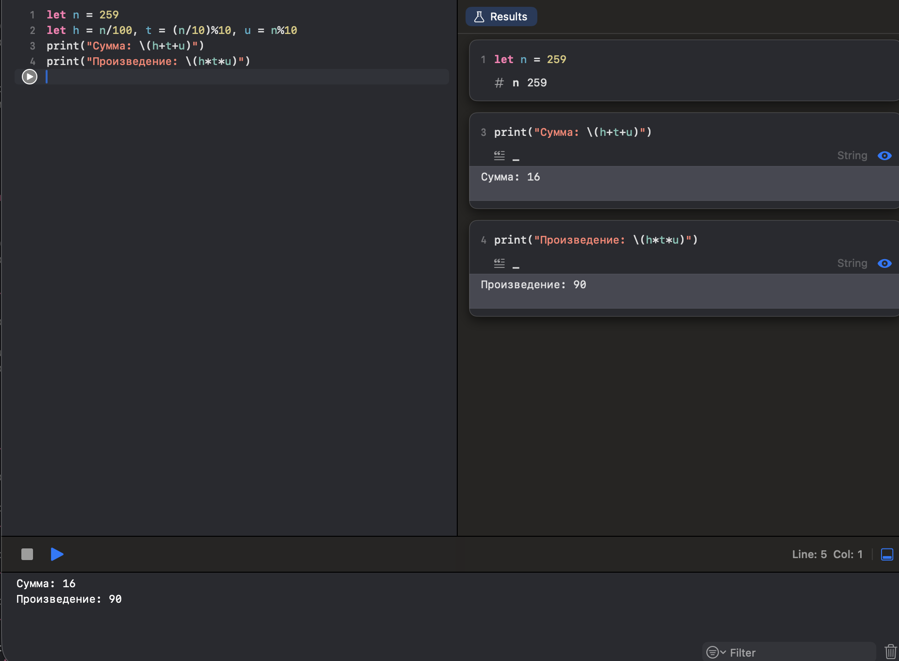
*Рис. 4.3 — Код и результат в Xcode Playground*

### Исходный код (ключевые части)

```swift
func digits(of number: Int) -> (hundreds: Int, tens: Int, units: Int) {
    return (number / 100, (number / 10) % 10, number % 10)
}

func isSumTwoDigit(_ number: Int) -> Bool {
    let d = digits(of: number)
    let sum = d.hundreds + d.tens + d.units
    return sum >= 10 && sum <= 99
}

func isProductThreeDigit(_ number: Int) -> Bool {
    let d = digits(of: number)
    let product = d.hundreds * d.tens * d.units
    return product >= 100 && product <= 999
}
```

### Протокол тестирования

| # | Число | Сумма цифр | Двузначная? | Произведение цифр | Трёхзначное? | Тест |
|---|-------|-----------|------------|-------------------|-------------|------|
| 1 | 123 | 6 | Нет | 6 | Нет | ✓ |
| 2 | 199 | 19 | Да | 81 | Нет | ✓ |
| 3 | 259 | 16 | Да | 90 | Нет | ✓ |
| 4 | 599 | 23 | Да | 405 | Да | ✓ |
| 5 | 999 | 27 | Да | 729 | Да | ✓ |
| 6 | 100 | 1 | Нет | 0 | Нет | ✓ |

### Ответы на вопросы

**1. Что такое Swift REPL?**
REPL (Read-Eval-Print Loop) — интерактивная оболочка для выполнения Swift-кода строка за строкой. Используется для быстрого прототипирования, проверки синтаксиса и изучения языка без создания полноценного проекта. Запускается командой `swift repl` в терминале.

**2. Что такое Playground?**
Playground — интерактивная среда в Xcode, где код выполняется в реальном времени и результаты видны сразу в боковой панели. Используется для: изучения языка Swift, прототипирования алгоритмов, визуализации данных, демонстрации кода.

**3. Как компилировать Swift в консоли bash?**
```bash
swiftc имя_файла.swift -o имя_программы
./имя_программы
```
Для нескольких файлов: `swiftc file1.swift file2.swift -o app`

---

## Задание 5 — Git в Xcode {#задание-5}

**Цель:** Изучить работу с git-репозиторием в Xcode, подключить внешний репозиторий.

### Ответы на вопросы

**1. Как создать локальный git-репозиторий в Xcode?**
При создании проекта: установить флажок «Create Git repository on my Mac». Для существующего проекта: Source Control → New Git Repositories.

**2. Как добавить внешний репозиторий? (два способа)**
- **Способ 1:** Xcode → Settings → Accounts → нажать «+» → добавить GitHub/GitLab аккаунт, затем Source Control → Remotes → Add Remote.
- **Способ 2:** Source Control → Clone → ввести URL репозитория GitHub.

**3. Как создать ветку в Xcode?**
Source Control → New Branch → ввести имя ветки (например, `feature-task2`) → Create.

**4. Как отменить commit в Xcode?**
Source Control → Amend commit (для последнего коммита). Или через Source Control → History → выбрать коммит → Revert Changes in Commit.

**5. Как слить ветки в Xcode?**
Переключиться на целевую ветку (например, `main`), затем Source Control → Merge → выбрать ветку-источник → Merge.

---

## Задание 6 — Словарь на Swift (SPM) {#задание-6}

**Цель:** Разработать консольное приложение для обработки текстовых данных на основе словаря с использованием Swift Package Manager.

**Задание вариант 8:** Словарь с данными об автомобилях `Avto(model, cost)` и производителях `Vendor(name, country)`.

### Структура проекта (SPM)

```
task6/
├── Package.swift                      — файл пакета SPM
└── Sources/
    └── task6/
        ├── Models/
        │   ├── Avto.swift             — модель Avto(model, cost)
        │   └── Vendor.swift           — модель Vendor(name, country)
        ├── DictionaryManager.swift    — все операции над словарями
        └── main.swift                 — меню из 22 пунктов
```

### Модели данных

```swift
struct Avto: CustomStringConvertible {
    var model: String
    var cost: Double
}

struct Vendor: CustomStringConvertible {
    var name: String
    var country: String
}
```

### Сборка и запуск

```bash
cd task6
swift build
swift run
```

### Скриншоты

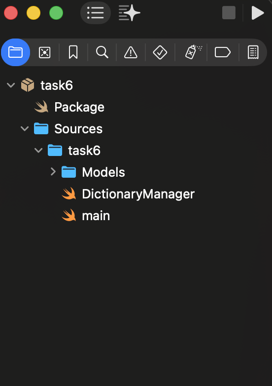
*Рис. 6.1 — Структура Swift Package*

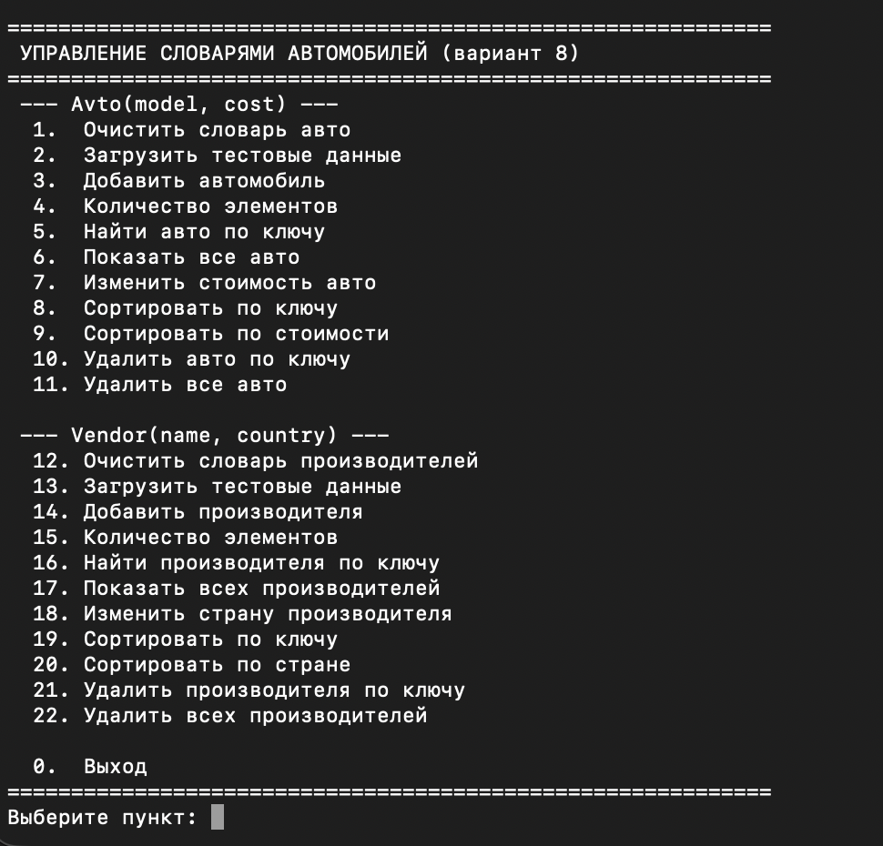
*Рис. 6.2 — Главное меню программы*

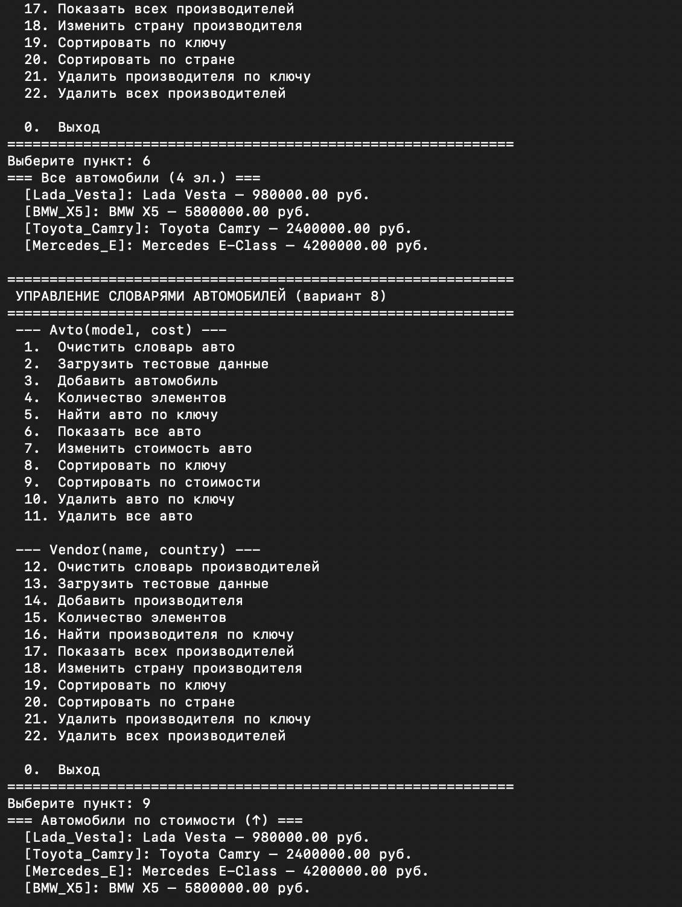
*Рис. 6.3 — Результат операций с словарём Avto*

### Протокол тестирования

| # | Операция | Входные данные | Ожидаемый результат | Фактически | Тест |
|---|---------|---------------|--------------------|-----------|----|
| 1 | Загрузить тест. данные (пункт 2) | — | 4 авто в словаре | 4 авто | ✓ |
| 2 | Количество (пункт 4) | — | 4 | 4 | ✓ |
| 3 | Найти по ключу (пункт 5) | `BMW_X5` | BMW X5 — 5800000.00 руб. | Найдено | ✓ |
| 4 | Найти несущ. (пункт 5) | `Honda` | "не найден" | "не найден" | ✓ |
| 5 | Добавить авто (пункт 3) | key=`Tesla_S`, model=`Tesla Model S`, cost=8000000 | Добавлен | Добавлен | ✓ |
| 6 | Изменить стоимость (пункт 7) | `BMW_X5`, 6000000 | Обновлено | Обновлено | ✓ |
| 7 | Сортировка по ключу (пункт 8) | — | BMW_X5, Lada_Vesta, Mercedes_E, Toyota_Camry, Tesla_S | Верный порядок | ✓ |
| 8 | Сортировка по стоимости (пункт 9) | — | от Lada к Tesla | Верный порядок | ✓ |
| 9 | Удалить по ключу (пункт 10) | `Lada_Vesta` | Удалён | Удалён | ✓ |
| 10 | Удалить все (пункт 11) | — | Словарь пуст | Пусто | ✓ |

### Ответы на вопросы

**1. Режимы работы среды Xcode:**
Standard Editor, Assistant Editor, Version Editor. Также: Debug mode (при запуске), Archive mode (сборка для публикации).

**2. Отличия Swift от C и C++:**
- Нет указателей и ручного управления памятью (ARC).
- Опциональные типы (`String?`) вместо `NULL`.
- Замыкания вместо указателей на функции.
- Строгая типизация, нет неявного приведения.
- Протоколы + расширения вместо множественного наследования.
- Нет заголовочных файлов.

**3. Способы отладки в Xcode:**
- Брейкпоинты (Breakpoints) — пауза в нужной строке.
- LLDB консоль — команды `po`, `p`, `bt`.
- View Debugger — визуальная иерархия UI.
- Memory Debugger — граф объектов в памяти.
- Instruments — профилирование производительности.

**4. Операторы Swift:**
Арифметические (`+`, `-`, `*`, `/`, `%`), сравнения (`==`, `!=`, `<`, `>`), логические (`&&`, `||`, `!`), диапазон (`...`, `..<`), nil-объединения (`??`), опциональной цепочки (`?.`), тернарный (`? :`).

**5. Типы коллекций Swift:**
- `Array` — упорядоченный список, доступ по индексу O(1).
- `Dictionary` — пары ключ-значение, доступ по ключу O(1), неупорядоченный.
- `Set` — неупорядоченное множество уникальных элементов, O(1) поиск.

**6. Типы проектов Xcode:**
iOS App, macOS App, watchOS App, tvOS App, Framework, Static Library, Swift Package, Playground, Command Line Tool.

---

## Задание 7 — Массивы на Swift (MVC) {#задание-7}

**Цель:** Разработать консольное приложение для обработки массивов с применением MVC и опциональных типов.

**Задание вариант 8:** Класс `DataManipulator`, принимающий опциональный массив строк. Метод сортировки по количеству гласных.

### Структура проекта (MVC)

```
task7/
├── Package.swift
└── Sources/
    └── task7/
        ├── Models/
        │   └── DataManipulator.swift   — модель, опциональный [String]?
        ├── Views/
        │   └── ConsoleView.swift       — весь ввод-вывод
        ├── Controllers/
        │   └── AppController.swift     — связывает модель и представление
        └── main.swift                  — точка входа
```

### Ключевые части кода

**Модель — DataManipulator:**
```swift
class DataManipulator {
    var strings: [String]?          // опциональный массив

    func sortedByVowelCount() -> [String]? {
        return strings?.sorted { vowelCount(in: $0) < vowelCount(in: $1) }
    }

    private func vowelCount(in str: String) -> Int {
        let vowels: Set<Character> = ["a","e","i","o","u","A","E","I","O","U",...]
        return str.filter { vowels.contains($0) }.count
    }
}
```

**MVC-связь:**
- `AppController` владеет `DataManipulator` (модель) и `ConsoleView` (представление).
- Представление не знает о модели.
- Контроллер запрашивает данные у представления и передаёт их в модель.

### Скриншоты

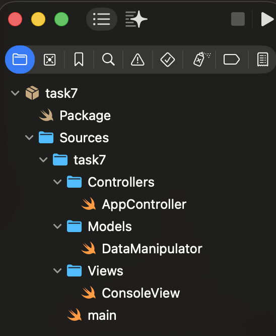
*Рис. 7.1 — Структура MVC в Xcode*

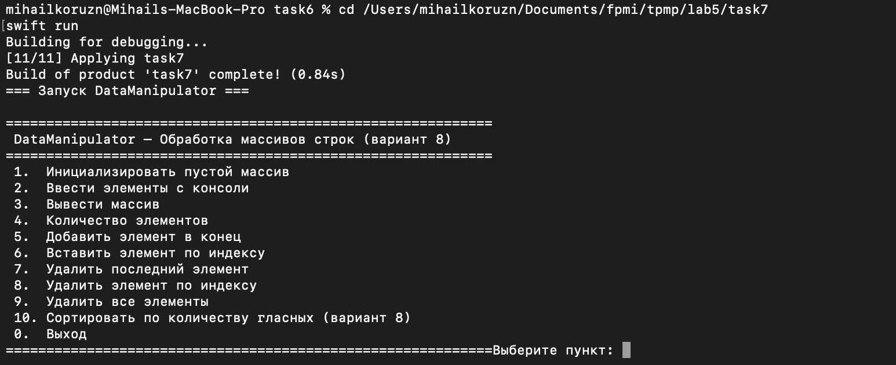
*Рис. 7.2 — Меню DataManipulator*

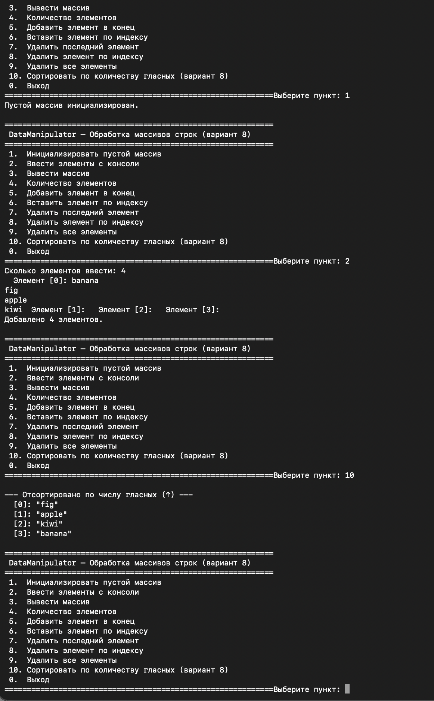
*Рис. 7.3 — Результат сортировки по числу гласных*

### Протокол тестирования

| # | Операция | Входные данные | Ожидаемый результат | Фактически | Тест |
|---|---------|---------------|--------------------|-----------|----|
| 1 | Инициализировать пустой массив | — | `[]` | `[]` | ✓ |
| 2 | Добавить элементы | "apple", "fig", "banana", "kiwi" | 4 элемента | 4 элемента | ✓ |
| 3 | Вывести массив | — | [0]"apple" [1]"fig" [2]"banana" [3]"kiwi" | Верно | ✓ |
| 4 | Количество элементов | — | 4 | 4 | ✓ |
| 5 | Добавить в конец | "mango" | 5 элементов | 5 элементов | ✓ |
| 6 | Вставить по индексу | "pear" at 1 | [1]="pear" | Верно | ✓ |
| 7 | Удалить последний | — | "mango" удалён | Верно | ✓ |
| 8 | Удалить по индексу | index 0 | "apple" удалён | Верно | ✓ |
| 9 | Сортировка по гласным | ["banana","fig","apple","kiwi"] | fig(1) < kiwi(2) < apple(2) < banana(3) | Верный порядок | ✓ |
| 10 | Удалить все | — | `[]` | `[]` | ✓ |

### Ответы на вопросы

**1. Как создать пустой массив типа Int в Swift?**
```swift
var arr: [Int] = []
var arr = [Int]()
var arr = Array<Int>()
```

**2. Что произойдёт при объявлении массива как `let` и попытке изменить его размер?**
Ошибка компиляции: `"cannot mutate immutable value"`. Массив-константа не позволяет ни добавлять, ни удалять элементы.

**3. Метод добавления элемента в конец массива:**
`array.append(element)` или `array += [element]`

**4. Какой тип данных должен быть у всех элементов массива?**
Одинаковый (Swift строго типизирован). Для разных типов используют `[Any]` или перечисления.

**5. Что означает "массив является универсальной коллекцией"?**
`Array<T>` — дженерик-тип, может хранить элементы любого типа T, заданного при создании. Тип T определяется при компиляции, что обеспечивает типобезопасность.

**6. Метод перебора элементов массива с получением индекса:**
`array.enumerated()` — возвращает последовательность пар `(index, element)`:
```swift
for (i, el) in array.enumerated() {
    print("[\(i)]: \(el)")
}
```
